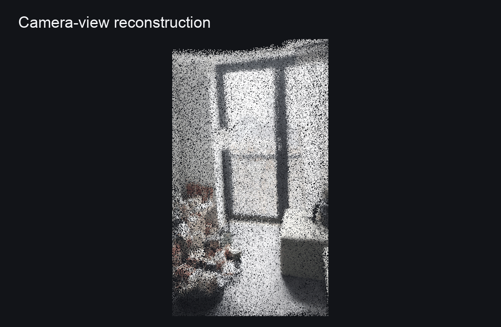
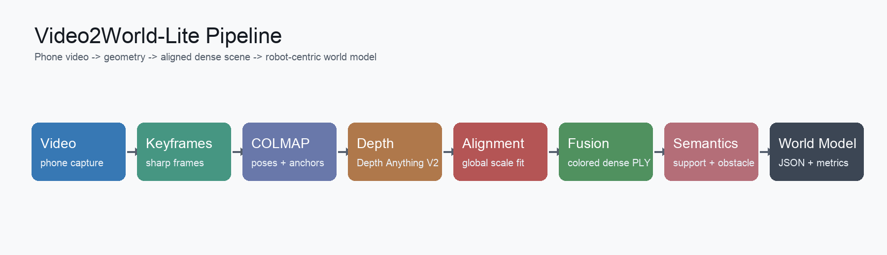
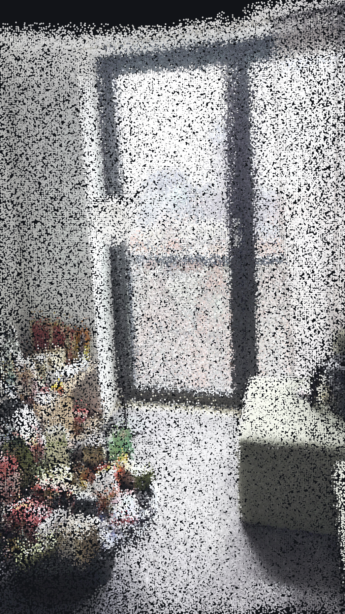
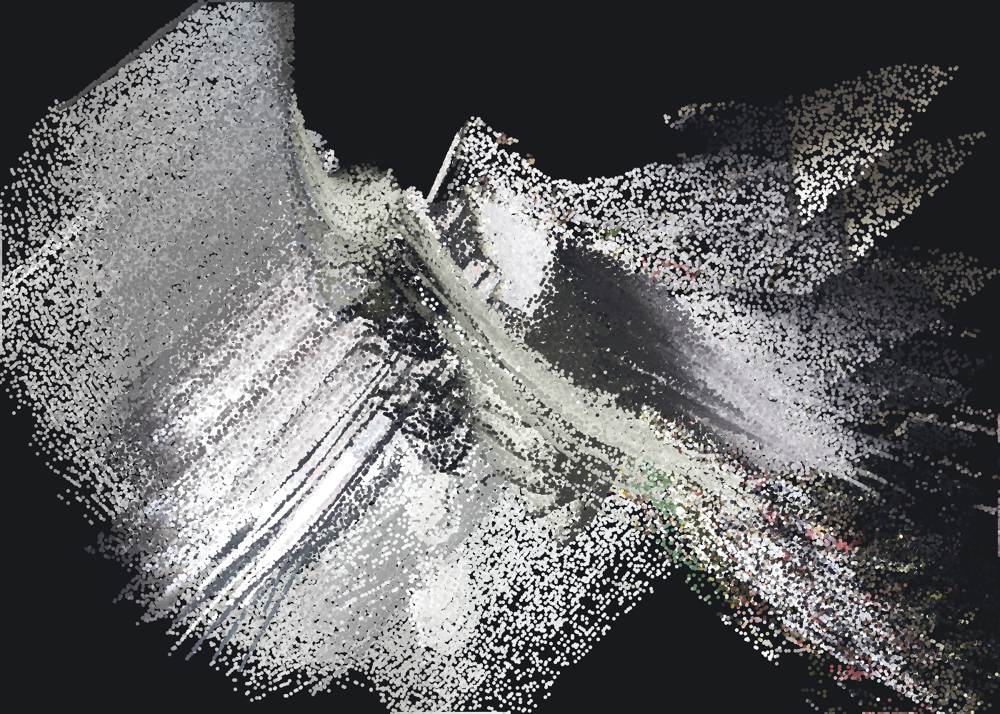
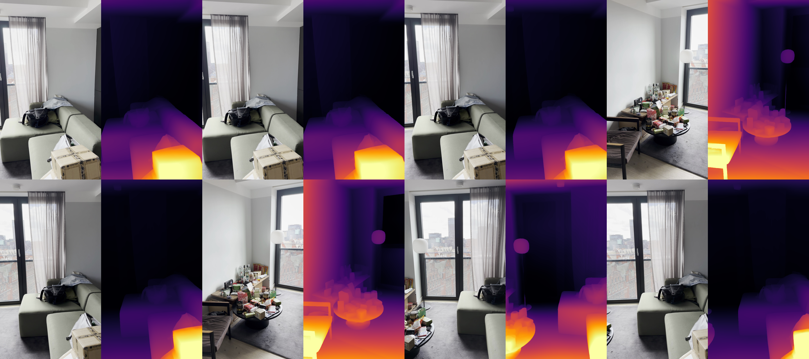
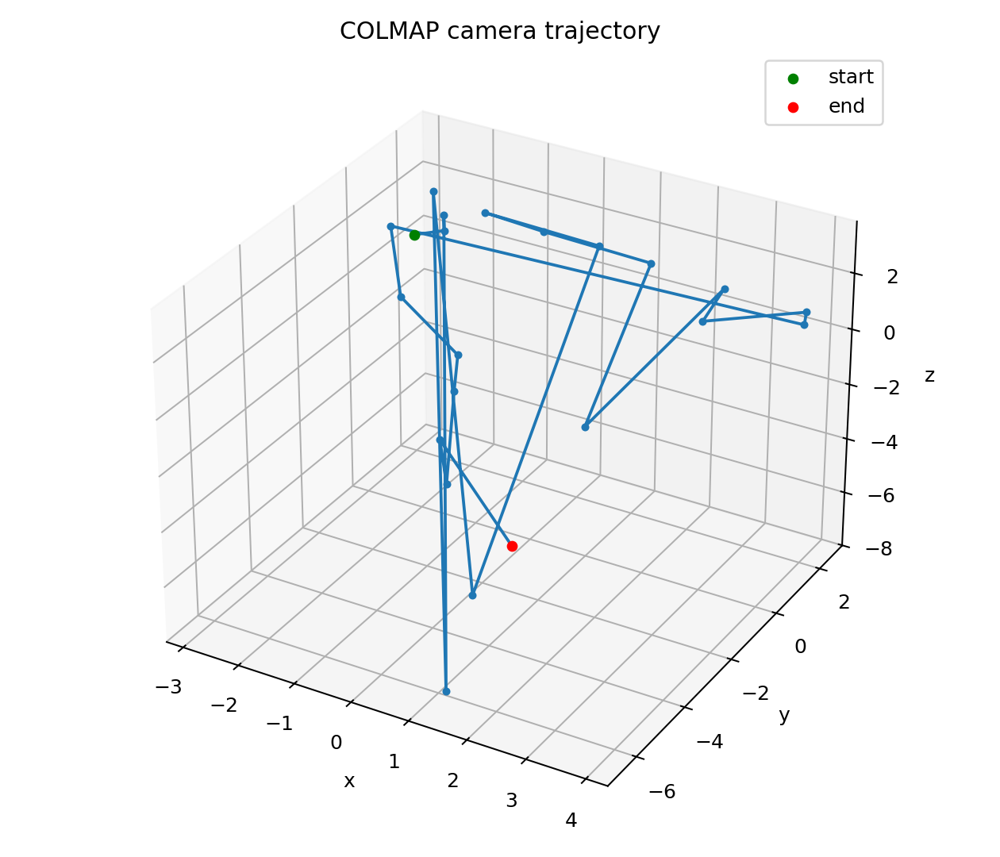
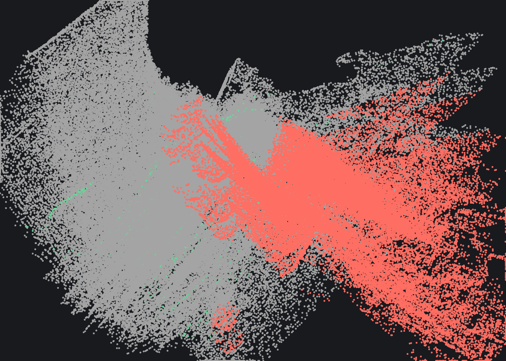

# Video2World-Lite

> Monocular phone video to a robot-centric 3D world model.

Video2World-Lite is a lightweight submission for Humanoid's **Intern Challenge: From Video to 3D Reconstruction**. It reconstructs an indoor scene from a short phone video by combining COLMAP camera poses, Depth Anything V2 dense depth, sparse-geometry scale alignment, multi-view point-cloud fusion, geometry-derived semantic cues, and quantitative evaluation.



## One-command Demo

Place a short indoor phone video at `data/raw/input_video.mp4`, then run:

```bash
make demo
```

Equivalent explicit command:

```bash
VIDEO=data/raw/input_video.mp4 RUN_DIR=outputs/demo_room ./scripts/run_demo.sh
```

Expected outputs:

- `pointclouds/cleaned_scene.ply`
- `pointclouds/presentation_scene.ply`
- `pointclouds/semantic_scene.ply`
- `visualizations/hero_camera_view.png`
- `visualizations/hero_scene.png`
- `visualizations/semantic_scene.png`
- `visualizations/camera_trajectory.png`
- `evaluation/evaluation_report.json`
- `world_model/world_model.json`

## Challenge Criteria Mapping

| Humanoid cares about | How this repo addresses it |
| --- | --- |
| Simplicity and usability | `make demo`, `scripts/run_demo.sh`, clear output directory structure, capture guide |
| Creativity | robot-centric world model instead of only a visual point cloud |
| 3D reconstruction quality | COLMAP poses + aligned dense monocular depth + point-cloud cleaning |
| Clear presentation | teaser GIF, pipeline diagram, camera-view render, depth grid, trajectory, semantic preview |
| Geometry-semantic coherence | semantic labels are assigned directly on reconstructed 3D points |
| Evaluation | registration, alignment, cleaning, artifact, and semantic-coverage metrics |

## Why This Is More Than a Point Cloud

This project treats 3D reconstruction as a robot perception problem. Instead of only producing a visually appealing point cloud, the system exports:

1. camera trajectory
2. sparse geometric anchors
3. aligned dense geometry
4. cleaned scene representation
5. geometry-derived support-plane and obstacle labels
6. robot-facing metadata in `world_model.json`
7. reconstruction and semantic-coherence metrics in `evaluation_report.json`

## Method



```text
Phone video
-> sharp keyframes
-> COLMAP camera poses and sparse points
-> Depth Anything V2 dense depth
-> global sparse-geometry depth scale alignment
-> multi-view point-cloud fusion
-> robust crop and cleaning
-> geometry-derived semantic labels
-> evaluation report and robot-centric world_model.json
```

Key design choices:

- **COLMAP for poses**: classical SfM provides camera trajectory and sparse geometric anchors.
- **Depth Anything V2 for density**: pretrained monocular depth fills surfaces that sparse SfM cannot represent.
- **Global scale alignment**: monocular depth is not treated as metric truth. Dense predictions are globally aligned to COLMAP sparse depth samples before fusion.
- **Robot-centric packaging**: final outputs include geometry, trajectory, semantic cues, metrics, limitations, and artifact paths.
- **No training required**: designed to run on consumer hardware, including Apple Silicon.

## Example Results

The example below was generated from a short indoor phone video with lateral camera motion.

| Camera-view reconstruction | Oblique dense reconstruction |
| --- | --- |
|  |  |

| Depth predictions | Camera trajectory |
| --- | --- |
|  |  |

| Geometry-derived semantic labels |
| --- |
|  |

Semantic colors:

- green: support-plane points
- red: obstacle-region points
- gray: unknown/background geometry

## Quantitative Summary

The current sample run writes `assets/example_outputs/evaluation_report.json` and reports:

| Metric | Value |
| --- | ---: |
| Keyframes | 22 |
| COLMAP registered frames | 22 |
| Registration ratio | 1.00 |
| Sparse SfM points | 8,369 |
| Raw dense points | 1,143,648 |
| Cleaned dense points | 1,101,192 |
| Alignment success rate | 1.00 |
| Median normalized alignment residual | 0.1071 |
| Outlier removed ratio | 0.0371 |
| Semantic labeled points | 246,698 |
| Semantic coverage | 0.2494 |

The normalized alignment residual is `abs(aligned_depth - sparse_depth) / sparse_depth`, so it is more interpretable than raw residual in COLMAP's arbitrary reconstruction scale.

## Geometry-Semantics Coherence

The semantic extension intentionally starts simple:

```text
cleaned/presentation point cloud
-> RANSAC dominant support-plane fitting
-> label near-plane points as support_plane
-> label points significantly above the plane as obstacle
-> export semantic_scene.ply and semantic_objects.json
```

This is not object recognition. The goal is to add robot-relevant spatial cues while keeping labels geometrically coherent. Since labels are assigned directly to reconstructed 3D points, the semantic point cloud cannot drift away from the geometry it describes.

## Installation

```bash
python -m venv .venv
source .venv/bin/activate
pip install -r requirements.txt
```

External tools:

- COLMAP must be available as `colmap` on `PATH`.
- Depth Anything V2 must be available from the official repository.
- The default config expects the official repo at `third_party/Depth-Anything-V2` and the small checkpoint at `third_party/Depth-Anything-V2/checkpoints/depth_anything_v2_vits.pth`.

Check the environment:

```bash
make check
```

## Useful Commands

```bash
make demo
make test
make readme-assets RUN_DIR=outputs/demo_room
make semantics RUN_DIR=outputs/demo_room
make evaluate RUN_DIR=outputs/demo_room
make submission-assets
```

Run the pipeline on a custom video:

```bash
make demo VIDEO=data/raw/my_room_video.mp4 RUN_DIR=outputs/my_room
```

Run a dependency-light smoke test of the depth stage:

```bash
make smoke
```

## Step-by-Step Usage

```bash
RUN=outputs/demo_room
python scripts/01_extract_keyframes.py --video data/raw/input_video.mp4 --output $RUN/frames
python scripts/02_run_colmap.py --frames $RUN/frames --workspace $RUN/colmap
python scripts/03_convert_colmap_model.py --input $RUN/colmap/sparse/0 --output $RUN/colmap/text_model
python scripts/04_estimate_depth.py --frames $RUN/frames --output $RUN/depth
python scripts/05_align_depth_scale.py --model $RUN/colmap/text_model --depth $RUN/depth --output $RUN/depth_aligned
python scripts/06_fuse_pointcloud.py --model $RUN/colmap/text_model --frames $RUN/frames --depth $RUN/depth_aligned --output $RUN/pointclouds/raw_scene.ply
python scripts/07_clean_pointcloud.py --input $RUN/pointclouds/raw_scene.ply --output $RUN/pointclouds/cleaned_scene.ply
python scripts/08_build_world_model.py --scene-id demo_room --input-video data/raw/input_video.mp4 --frames $RUN/frames --model $RUN/colmap/text_model --raw $RUN/pointclouds/raw_scene.ply --cleaned $RUN/pointclouds/cleaned_scene.ply --output $RUN/world_model/world_model.json --scale-aligned
python scripts/09_visualize_results.py --model $RUN/colmap/text_model --cloud $RUN/pointclouds/cleaned_scene.ply --trajectory-output $RUN/visualizations/camera_trajectory.png --scene-output $RUN/visualizations/scene_preview.png
python scripts/10_make_readme_assets.py --run-dir $RUN --config config/default.yaml --skip-mesh
python scripts/12_add_semantics.py --run-dir $RUN
python scripts/11_evaluate_reconstruction.py --run-dir $RUN
```

## Repository Layout

```text
config/default.yaml
scripts/run_demo.sh
scripts/11_evaluate_reconstruction.py
scripts/12_add_semantics.py
src/video2world/evaluation.py
src/video2world/semantics.py
docs/capture_guide.md
assets/pipeline.png
assets/teaser.gif
assets/example_outputs/
```

## Capture Guide

See `docs/capture_guide.md`. In short: use 10-30 seconds of slow lateral motion, keep strong overlap between views, avoid motion blur, avoid reflective/transparent surfaces, and include textured objects or edges.

## Limitations and Failure Cases

- Monocular video has scale ambiguity; this pipeline aligns to COLMAP's sparse reconstruction scale, not real-world meters.
- COLMAP world coordinates are not automatically gravity-aligned.
- Geometry-derived semantics provide support-plane and obstacle cues, not open-vocabulary object labels.
- Textureless walls, reflective surfaces, and fast camera motion can reduce reconstruction quality.
- Dynamic objects are not explicitly removed.
- Poisson mesh reconstruction is generated as an optional artifact, but the dense point cloud is the primary reconstruction output.

## Tests

```bash
make test
```

Tests cover COLMAP text parsing, camera geometry, scale alignment, RGB-D fusion, presentation crop/rendering, evaluation metrics, geometry-derived semantics, PLY writing, and world-model JSON export.

## Resume Summary

```latex
\textbf{Video2World-Lite: Robot-Centric 3D World Model from Monocular Video}
\begin{itemize}
    \item Built a lightweight video-to-3D reconstruction system for the Humanoid intern challenge, converting indoor phone videos into robot-centric 3D world models using COLMAP, Depth Anything V2, and Open3D/NumPy-based point cloud fusion.
    \item Estimated camera trajectories and sparse geometry with SfM, aligned scale-ambiguous dense depth predictions to COLMAP sparse points, and fused registered RGB-D observations into cleaned colored PLY point clouds.
    \item Added reconstruction evaluation and presentation artifacts including camera trajectory, depth grids, dense scene previews, world-model metadata, and quantitative point-cloud statistics.
    \item Extended the geometry pipeline with semantic world-model cues such as support-plane and obstacle regions, ensuring semantic labels are assigned directly on reconstructed 3D geometry.
\end{itemize}
```
